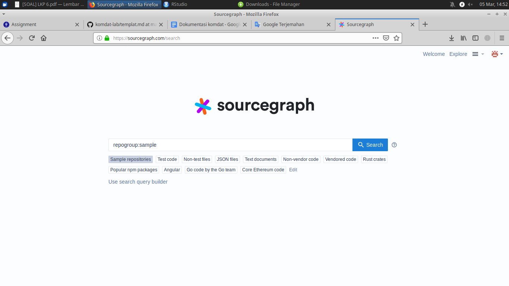
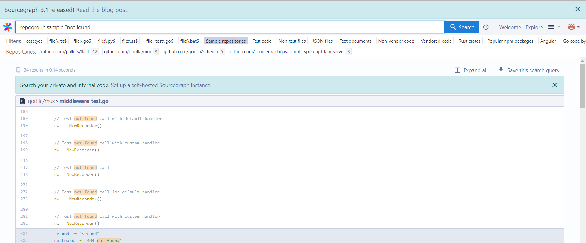
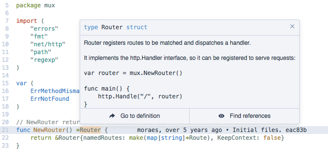
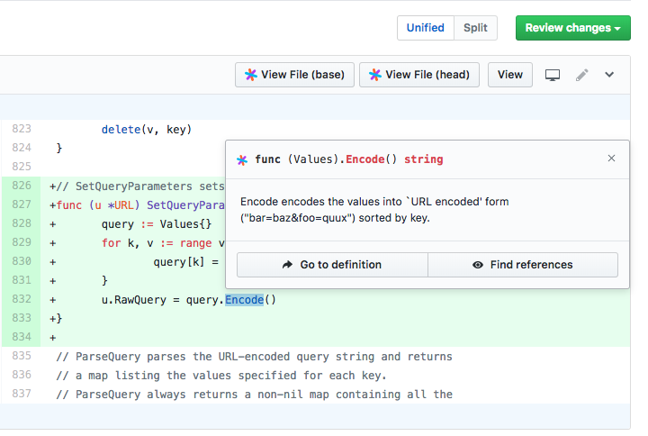
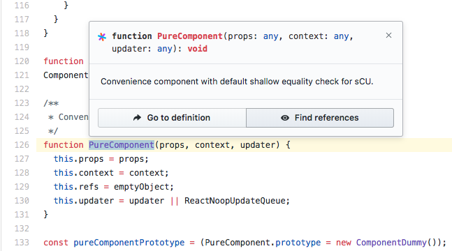

# Aplikasi Web "Source Graph"

## Sekilas Tentang

**Sourcegraph** adalah alat pencarian kode untuk pengembang. Memungkinkan kita mencari dan menjelajahi semua kode organisasi kita di web, dengan integrasi ke dalam perangkat kita.

Apa yang dilakukan Sourcegraph?
Fitur utama **Sourcegraph** adalah:
- Pencarian kode: cepat, terkini, dan terukur, dengan dukungan regexp pada cabang apa pun atau melakukan tanpa penundaan pengindeksan (dan pencarian berbeda)
- Intelijen kode: lompat-ke-definisi, temukan referensi, dan fitur penjelajahan kode IDE-like yang cerdas lainnya di cabang, komit, atau PR / review kode
- Instalasi mandiri yang mudah dan aman (kode Anda tidak pernah menyentuh server kami)
- Integrasi dengan host kode, alat peninjau kode, editor, browser web, dll.


## Instalasi

Prasyarat, apa saja yang harus diinstal sebelumnya.
  - Virtual Box
  - Ubuntu Server

Langkah instalasi dalam CLI.
1. Setup The Repository
  - Install packages to allow apt to use a repository over HTTPS:
      ```
      $ sudo apt-get install \
      apt-transport-https \
      ca-certificates \
      curl \
      gnupg-agent \
      software-properties-common
      ```
  - Add Docker’s official GPG key:
      ```
      $ curl -fsSL https://download.docker.com/linux/ubuntu/gpg | sudo apt-key add -
      ```
  - Set up the stable repository
      ```
      $ sudo add-apt-repository \
      "deb [arch=amd64] https://download.docker.com/linux/ubuntu \
      $(lsb_release -cs) \
      stable"
      ```
2. Install Docker
  - Install the latest version of Docker CE and containerd
  ```
  $ sudo apt-get install docker-ce docker-ce-cli containerd.io
  ```
  - Verify that Docker CE is installed correctly by running the hello-world image
  ```
  $ sudo docker run hello-world
  ```
3. Install Source Graph
  a. docker run 
  ```
  --publish 7080:7080 --publish 2633:2633 --rm
  --volume ~/.sourcegraph/config:/etc/sourcegraph 
  --volume ~/.sourcegraph/data:/var/opt/sourcegraph 
  sourcegraph/server:3.1.1
  ```

## Konfigurasi (opsional)

Setting server tambahan yang diperlukan untuk meningkatkan fungsi dan kinerja aplikasi, misalnya:
- batas upload file
- batas memori
- dll

Plugin untuk fungsi tambahan
- login dengan Google/Facebook
- editor Markdown
- dll


##  Maintenance (opsional)

Setting tambahan untuk maintenance secara periodik, misalnya:
- buat backup database tiap pekan
- hapus direktori sampah tiap hari
- dll


## Otomatisasi (opsional)

Skrip shell untuk otomatisasi instalasi, konfigurasi, dan maintenance.


## Cara Pemakaian
# Fitur pencarian kode
Contoh pemakaian:
Buka sourcegraph.com dan sign in terlebih dahulu. Akan langsung dialihkan ke sourcegraph.com/search.

Misal akan mencari **repogroup:sample "not found"** maka akan keluar hasil pencarian berikut. 


Untuk menggunakan repository milik tim sendiri saat menggunakan fitur pencarian, harap menginstal terlebih dahulu seperti diatas.
Baca [dokumentasi pencarian kode](https://docs.sourcegraph.com/user/search) untuk informasi lebih lanjut.
# Fitur intelijen kode
Sourcegraph menyediakan intelijen kode pada:
1. File kode pada UI web Sourcegraph

2. Diffs pada alat review kode, menggunakan [integrasi](https://docs.sourcegraph.com/integration)

3. File kode pada host kode milik sendiri, menggunakan [integrasi](https://docs.sourcegraph.com/integration)


Baca [dokumentasi intelijen kode](https://docs.sourcegraph.com/user/code_intelligence) untuk informasi lebih lanjut.

## Pembahasan

- Pendapat anda tentang aplikasi web ini
    - kelebihan
    - kekurangan
- Bandingkan dengan aplikasi web lain yang sejenis


## Referensi

1. [About Source Graph](https://docs.sourcegraph.com/user) - Source Graph
2. [How to Install Source Graph](https://docs.sourcegraph.com/admin/install/docker) - Source Graph
3. [About Docker](https://docs.docker.com/install/) - Docker
4. [How to Install Docker](https://docs.docker.com/install/linux/docker-ce/ubuntu/) - Docker
